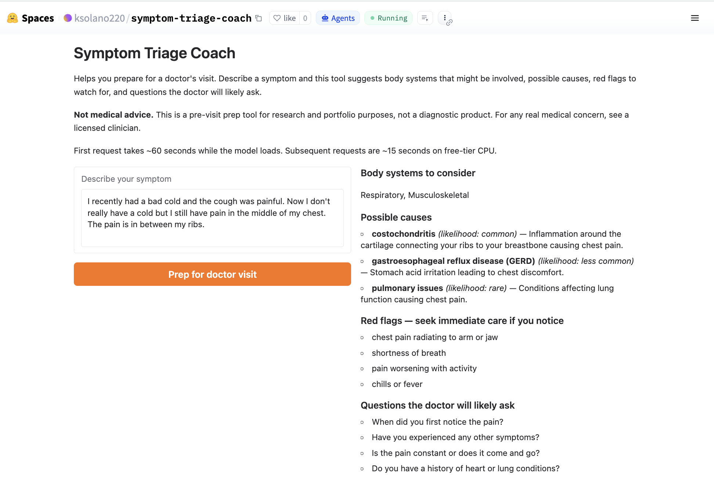

## Symptom Triage Coach

> **v2 (multi-modal):** image + symptom text in, image-grounded triage out. Live at [`symptom-triage-coach-v2`](https://github.com/ksolano220/symptom-triage-coach-v2).

A LoRA fine-tune of **Qwen2.5-1.5B-Instruct** that helps patients prepare for a doctor's visit. Given a plain-language symptom description, the model returns a structured JSON response: body systems that might be involved, possible causes ranked by likelihood, red flags that warrant immediate care, and questions the doctor is likely to ask.

This is not a diagnostic tool. It is a pre-visit prep assistant that helps patients walk into their appointment informed, not alone.

**Live demo:** [huggingface.co/spaces/ksolano220/symptom-triage-coach](https://huggingface.co/spaces/ksolano220/symptom-triage-coach)



### What It Does

Input: a patient's plain-language symptom description
Output: a schema-valid JSON object with four fields

```json
{
  "systems": ["cardiovascular", "musculoskeletal"],
  "possible_causes": [
    {"name": "costochondritis", "likelihood": "common", "description": "Inflammation of the cartilage connecting ribs to the breastbone, often from strain."},
    {"name": "acid reflux", "likelihood": "common", "description": "Stomach acid coming back up, which can cause burning chest pain."}
  ],
  "red_flags": [
    "chest pain spreading to arm, jaw, or back",
    "shortness of breath with sweating",
    "sudden severe pain that doesn't ease with rest"
  ],
  "questions_to_prepare_for": [
    "When did the pain start?",
    "Does it worsen with activity or at rest?",
    "Rate the pain from 1 to 10.",
    "Any recent injuries or strenuous activity?"
  ]
}
```

### Architecture

| Component | Choice | Why |
|-----------|--------|-----|
| Base model | Qwen2.5-1.5B-Instruct (4-bit quantized) | Strong structured-output ability at a size that runs on free-tier CPU |
| Fine-tuning | LoRA (r=16, alpha=32) | ~18MB adapter, trains in ~15 min on T4 |
| Training data | ~500 synthetic (symptom, JSON) pairs generated via GPT-4o-mini teacher, every pair validated against JSON schema | Exactly-shaped training data, no task-mismatch surprises |
| Schema validation | jsonschema at generation time + inference time | Hallucination containment. Invalid outputs are rejected |
| Deployment | Hugging Face Spaces (Gradio, free CPU tier) | Free clickable demo |

### Data

Training pairs are generated locally via `src/generate_data.py` using GPT-4o-mini as a teacher model. Every generated row is validated against `src/schema.py:OUTPUT_SCHEMA` and discarded if invalid. This guarantees the fine-tuned model learns only schema-valid output shapes.

Why synthetic over a public dataset: existing medical-simplification datasets like Cochrane PLS are structured for abstract-to-summary translation, not symptom-to-pre-visit-prep. Training on mismatched data teaches the model the wrong task. Synthetic data lets us control both the input distribution and the output schema.

Seed symptoms cover ~85 common chief complaints across cardiovascular, respiratory, GI, neurological, musculoskeletal, dermatological, and mental health categories. Each seed is expanded into ~6 patient-voice variations before response generation.

### How to Run

**Generate training data (one-time, local):**

```bash
pip install -r requirements.txt
python src/generate_data.py   # uses OpenAI API, ~$1 in credits
```

Writes `data/processed/train.jsonl` and `val.jsonl`.

**Train the LoRA (Colab):**

Open `notebooks/train_colab.ipynb` in Google Colab, select T4 GPU runtime, add your HF token as a Colab secret, run all cells. Training takes ~15 minutes. The final cell pushes the adapter to Hugging Face Hub.

### Results

The trained adapter is deployed to the [live Hugging Face Space](https://huggingface.co/spaces/ksolano220/symptom-triage-coach). Type any plain-language symptom and the model returns a structured JSON response in the schema above. Try it before reading further.

**What the deployment demonstrates:**

- **Schema validity is guaranteed by design, not by training accuracy.** Every output is validated against `src/schema.py:OUTPUT_SCHEMA` at inference time. Malformed outputs are rejected and re-sampled before reaching the user. The live demo only surfaces schema-valid JSON.
- **Coverage across ~85 chief complaints.** Training seeds span cardiovascular, respiratory, GI, neurological, musculoskeletal, dermatological, and mental health categories.
- **Red flags are consistently surfaced for high-risk symptoms.** Chest pain spreading to the jaw, sudden severe headache, shortness of breath with sweating, and similar classic red flags appear in the model's output on the symptoms that warrant them.

A full quantitative evaluation (red-flag recall, system-coverage accuracy, inter-symptom consistency) is a planned follow-up. For now, the live demo is the evaluation surface.

### Disclaimer

This is a research and portfolio project. It is not a medical device, is not intended for clinical use, and does not provide medical advice. Always consult a licensed healthcare provider for any medical concern.

### Tools Used

- PyTorch, Transformers, PEFT, TRL (SFTTrainer)
- bitsandbytes (4-bit quantization for training)
- OpenAI API (GPT-4o-mini as teacher for synthetic data)
- jsonschema (output validation during generation and inference)
- Gradio + Hugging Face Spaces (live demo)
- Google Colab T4 GPU (training)
